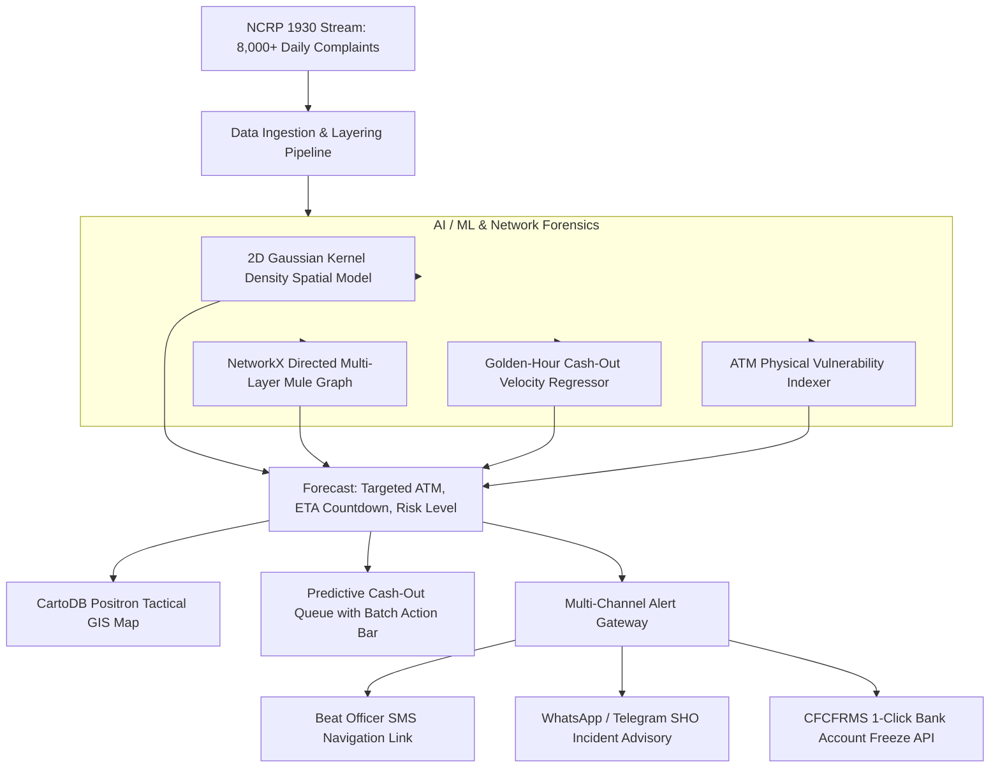

<div align="center">

<<<<<<< HEAD
# 👁️ CYBERSIGHT
=======
# 🛡️ CYBERSIGHT by Divyansh

>>>>>>> c885b6055ff1347f249be200d1c12f8cb03e8de4
### National Predictive Cybercrime Cash-Out Forecasting & Proactive Intervention Platform

[](https://www.python.org/)
[](https://fastapi.tiangolo.com/)
[](https://react.dev/)
[](https://tailwindcss.com/)
[](https://www.sqlite.org/)
[](LICENSE)
[](graphify-out/graph.html)

**An AI-driven operational defense framework developed for the Indian Cyber Crime Coordination Centre (I4C), Ministry of Home Affairs (MHA), State Law Enforcement Agencies (LEAs), and the Citizen Financial Cyber Fraud Reporting and Management System (CFCFRMS / 1930).**

</div>

---

## 📌 Problem Statement Background

<<<<<<< HEAD
The centralized **National Cybercrime Reporting Portal (NCRP)** currently receives **over 8,000 complaints daily**, predominantly involving financial cyber frauds (*Digital Arrest scams*, *Stock Investment fraud*, *Task/Work-from-Home scams*, *KYC phishing*, *Loan app extortion*).

Stolen money is routed rapidly across multiple banks through Layer 1, Layer 2, and Layer 3 mule accounts, and physical cash is extracted via **ATMs, Micro-ATMs, and Customer Service Points (CSPs)** within the critical **35-minute to 2-hour "Golden Hour"**. Conventional reactive freezing arrives after funds are already gone.

**CYBERSIGHT transforms the defense from reactive to proactive:**
=======
The centralized **National Cybercrime Reporting Portal (NCRP)** currently receives **over 8,000 complaints daily**, predominantly involving financial cyber frauds (_Digital Arrest scams_, _Stock Investment fraud_, _Task/Work-from-Home scams_, _KYC phishing_, _Loan app extortion_).

Stolen money is routed rapidly across multiple banks through Layer 1, Layer 2, and Layer 3 mule accounts, and physical cash is extracted via **ATMs, Micro-ATMs, and Customer Service Points (CSPs)** within the critical **35-minute to 2-hour "Golden Hour"**. Conventional reactive freezing arrives after funds are already gone.

**CYBER-NETRA transforms the defense from reactive to proactive:**

>>>>>>> c885b6055ff1347f249be200d1c12f8cb03e8de4
- **Forecasts likely cash withdrawal locations in advance** (ATM, Micro-ATM, Branch) using spatio-temporal AI models, Gaussian kernel density estimation, distance decay heuristics, and syndicate graph analysis.
- **Estimates physical cash-out timeframes (ETA countdowns)** based on transaction velocity and layering patterns.
- **Automates multi-agency interventions**: Instant geo-fenced PCR van dispatches and real-time CFCFRMS bank account freezes before cash is extracted.

---

## 🏗️ Architecture & Data Flow



---

## 🕸️ Codebase Knowledge Graph

> Generated with [graphify](https://github.com/safishamsi/graphify) — maps every component, API route, schema, and service as a navigable knowledge graph.

**151 nodes · 301 edges · 9 communities** — 90% extracted via AST, 10% inferred (avg confidence: 0.94). No import cycles detected.

### 🏛️ God Nodes — Core Abstractions (Most Connected)

| Rank | Symbol | Edges | Role |
|------|--------|-------|------|
| 1 | `Complaint` | 13 | Central data model — NCRP complaint schema used by API, engine, and seeder |
| 2 | `react` | 13 | Cross-community bridge — links all frontend components to package config |
| 3 | `PredictiveAnalyticsEngine` | 12 | Heart of the AI system — connects to ATM, RiskLevel, Prediction, routes |
| 4 | `RiskLevel` | 12 | Enum used by API routes, frontend, freeze logic, and dispatch |
| 5 | `Prediction` | 12 | Output schema linking engine → alerts → frontend → interventions |
| 6 | `lucide-react` | 12 | Icon library bridging component tree to package manifest |
| 7 | `InterventionStatus` | 10 | Tracks dispatch/freeze state across API, feed, and bank portal |
| 8 | `AlertDispatcherService` | 8 | Orchestrates SMS, WhatsApp, and CFCFRMS bank API dispatch |

### 🔗 Surprising Connections (Graphify Discovered)

- **`init_and_seed()`** → calls → **`generate_random_complaint()`**
  *The DB seeder (`database/seed_db.py`) silently depends on the backend data generator service — a hidden cross-layer dependency.*

- **`dispatch_unit()`** and **`freeze_account()`** both → use → **`AlertNotification`**
  *Both intervention types funnel through the same alert schema, so every police dispatch and bank freeze shares one notification pathway.*

- **`inject_custom_incident()`** → uses both **`Complaint`** AND **`LayerHop`**
  *The scenario injector simultaneously touches the NCRP complaint model and the money-layering forensics schema — a deep integration point.*

### 🗺️ 9 Detected Communities

| Community | Nodes | Cohesion | Description |
|-----------|-------|----------|-------------|
| FastAPI Routes & Endpoints | 27 | 0.16 | All 16 API routes, WebSocket manager, request models |
| React Frontend Components | 17 | 0.16 | App, LoginPage, all JSX component tree |
| Frontend Config & Package | 26 | 0.08 | package.json, vite.config, index.html, oxlint |
| AI Prediction Engine & Schemas | 15 | 0.12 | PredictiveAnalyticsEngine, Pydantic schemas, KDE logic |
| Frontend Dependencies | 9 | 0.22 | react, leaflet, recharts, tailwindcss, lucide-react |
| Data Generator & Seeder | 6 | 0.32 | Synthetic NCRP complaint generator + DB seeder |
| WebSocket Real-Time Layer | 3 | 0.33 | ConnectionManager, websocket_endpoint, broadcast |
| Linting & Code Quality | 5 | 0.33 | oxlint rules, react hooks rules |
| App Orchestration & API Client | — | — | App.jsx root + CyberNetraWebSocket client |

> **📂 Interactive Graph:** Open [`graphify-out/graph.html`](graphify-out/graph.html) in any browser — no server needed. Click any node to explore connections, filter by community, and trace data flows.

---

## 🗄️ Database & Curated Datasets

All database files, relational DDL schemas, and dataset exports are organized inside [`/database`](./database):

```
database/
├── schema.sql                   # Production DDL for SQLite 3 and PostgreSQL 14+
├── cyber_netra.db               # Pre-populated SQLite database file
├── seed_db.py                   # Automated seeder script (regenerates DB & CSVs)
├── DATA_DICTIONARY.md           # Complete data dictionary with field definitions & ERD
└── datasets/
    ├── atms_inventory.csv       # Geolocated ATMs & Micro-ATMs with vulnerability scores
    ├── atms_inventory.json
    ├── hotspots.csv             # Indian cybercrime hotspot corridors & mule density
    ├── hotspots.json
    ├── layer_hops.csv           # Multi-layer forensic transaction hops with UTR numbers
    ├── mule_syndicates.json     # Active criminal syndicates & nexus metadata
    ├── sample_complaints.csv    # 100 sample NCRP complaints stream
    └── sample_complaints.json
```

### Relational Schema Highlights:

- **`hotspots`**: Curated cybercrime operational zones (_Mewat-Nuh_, _Jamtara_, _Surat_, _Bharatpur_, _Gurugram_, _Delhi NCR_, _Hyderabad_, _Bengaluru_).
- **`atms`**: 120+ geolocated terminals with vulnerability scores, CCTV coverage, cash limits, and nearest police stations.
- **`complaints`**: Full NCRP schema with complainant information, amounts, and victim/mule accounts.
- **`layer_hops`**: Directed money transfers across Layer 1 to Layer 3 with bank IFSC and UTR numbers.
- **`predictions`**: AI-generated withdrawal forecasts with ETA minutes and confidence scores.
- **`interventions`**: Audit records of police dispatches and CFCFRMS account freezes.
- **`alert_logs`**: History of SMS, WhatsApp, and Bank API dispatches.

---

## 🚀 Key Platform Features

1. **🏛️ Official Government Light Mode Interface**:
   - Designed to **MHA / I4C / NIC standards** with the Indian National Tricolor stripe, high-contrast typography, and accessible data density.
2. **🔐 Secure Role-Based Login**:
   - Session-based authentication gating the entire portal (sessionStorage — clears on tab close per government security standards).
   - Four role levels: `I4C Apex Command`, `District Cyber Cell`, `Field Beat Officer`, `CFCFRMS Bank Nodal`.
3. **🗺️ Tactical GIS Risk Heatmap**:
   - Clean CartoDB Positron cartography with live pulsing radar blips on targeted ATMs (🔴 CRITICAL `<30m`, 🟠 HIGH, 🟢 Intercepted).
   - Time horizon slider (`Live Now`, `+30m Forecast`, `+2h Forecast`, `Past 24h`).
   - One-click sector jump teleport to active crime corridors.
4. **⚡ High-Efficiency Tools for Officials**:
   - **Instant Search**: Search across Ack ID, ATM name, bank, pin code, or district.
   - **Batch Freeze**: Check multiple critical forecasts and execute simultaneous bank liens.
   - **CSV Export**: Export daily complaints and cash-out predictions for leadership briefings.
   - **Alert Audio Chime**: Control-room notification sound for incoming critical threats.
   - **Help / SOP Guide**: Built-in 5-tab user manual covering roles, SOPs, legal provisions, and security.
5. **👥 Multi-Role Portals**:
   - **I4C Apex Strategic Command**: Nationwide KPI metrics and interstate syndicate correlations.
   - **District Cyber Cell (LEA)**: Detailed incident queue and dispatch orders.
   - **Field Beat Officer Mobile Desk**: High-contrast patrol cards with Google Maps GPS routing.
   - **CFCFRMS Bank Nodal Officer**: Queue of compromised accounts with 1-click legal freezes.
6. **🕸️ Multi-Layer Money Trail Explorer**:
   - Interactive visual graph tracing funds from Victim → Layer 1 → Layer 2 → Forecasted ATM.
7. **📄 Statutory Intelligence Notice (Section 91 CrPC / Section 94 BNSS)**:
   - Official printable legal directive with digital verification hash.

---

## 💻 Quickstart & Local Installation

### Prerequisites

- **Python 3.11+**
- **Node.js 18+** and **npm**

### 1. Clone the Repository

```bash
git clone https://github.com/YOUR_USERNAME/cybersight.git
cd cybersight
```

### 2. Setup Database & Datasets

```bash
cd database
python seed_db.py
cd ..
```

### 3. Setup and Run Backend (FastAPI)

```bash
cd backend
pip install -r requirements.txt
python -m uvicorn main:app --host 127.0.0.1 --port 8000
```
<<<<<<< HEAD
API Documentation: `http://127.0.0.1:8000/docs`

### 4. Setup and Run Frontend (React + Vite)
In a **new terminal**:
=======

API Documentation will be available at: `http://127.0.0.1:8000/docs`

### 4. Setup and Run Frontend (React + Vite)

In a new terminal:

>>>>>>> c885b6055ff1347f249be200d1c12f8cb03e8de4
```bash
cd frontend
npm install --legacy-peer-deps
npm run dev -- --host 127.0.0.1 --port 5173
```
<<<<<<< HEAD
Open your browser at: **`http://127.0.0.1:5173`**

### Demo Login Credentials

| Role | Username | Password |
|------|----------|----------|
| I4C Apex Command | `I4C_ADMIN` | `CyberNetra@2026` |
| District Cyber Cell | `LEA_OFFICER` | `Cyber@LEA2026` |
| Field Beat Officer | `BEAT_PCR` | `Beat@PCR2026` |
| CFCFRMS Bank Nodal | `BANK_NODAL` | `Bank@CFCFRMS2026` |
=======

Open your browser at: `http://127.0.0.1:5173`
>>>>>>> c885b6055ff1347f249be200d1c12f8cb03e8de4

---

## 📤 Pushing to Your GitHub Repository

```bash
# Initialize Git (skip if already done)
git init
git add .
<<<<<<< HEAD
git commit -m "feat: initial release of CYBERSIGHT predictive cybercrime framework"
git branch -M main

# Link your GitHub repository
git remote add origin https://github.com/YOUR_USERNAME/cybersight.git
=======

# 3. Create initial commit
git commit -m "feat: initial release of CYBERSIGHT predictive cybercrime framework"

# 4. Set main branch
git branch -M main

# 5. Link your GitHub repository (replace with your repo URL)
git remote add origin https://github.com/YOUR_USERNAME/cybersight.git

# 6. Push to GitHub
>>>>>>> c885b6055ff1347f249be200d1c12f8cb03e8de4
git push -u origin main
```

---

## 📜 License

This project is open-sourced under the [MIT License](LICENSE).
Developed for national cyber defense research and Smart India Hackathon / I4C problem statements.
