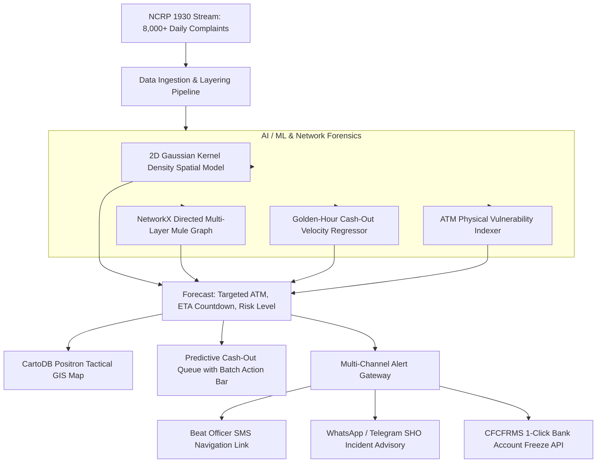

<div align="center">

# 🛡️ CYBER-NETRA
### National Predictive Cybercrime Cash-Out Forecasting & Proactive Intervention Platform

[](https://www.python.org/)
[](https://fastapi.tiangolo.com/)
[](https://react.dev/)
[](https://tailwindcss.com/)
[](https://www.sqlite.org/)
[](LICENSE)

**An AI-driven operational defense framework developed for the Indian Cyber Crime Coordination Centre (I4C), Ministry of Home Affairs (MHA), State Law Enforcement Agencies (LEAs), and the Citizen Financial Cyber Fraud Reporting and Management System (CFCFRMS / 1930).**

</div>

---

## 📌 Problem Statement Background

The centralized **National Cybercrime Reporting Portal (NCRP)** currently receives **over 8,000 complaints daily**, predominantly involving financial cyber frauds (*Digital Arrest scams*, *Stock Investment fraud*, *Task/Work-from-Home scams*, *KYC phishing*, *Loan app extortion*). 

Stolen money is routed rapidly across multiple banks through Layer 1, Layer 2, and Layer 3 mule accounts, and physical cash is extracted via **ATMs, Micro-ATMs, and Customer Service Points (CSPs)** within the critical **35-minute to 2-hour "Golden Hour"**. Conventional reactive freezing arrives after funds are already gone.

**CYBER-NETRA transforms the defense from reactive to proactive:**
- **Forecasts likely cash withdrawal locations in advance** (ATM, Micro-ATM, Branch) using spatio-temporal AI models, Gaussian kernel density estimation, distance decay heuristics, and syndicate graph analysis.
- **Estimates physical cash-out timeframes (ETA countdowns)** based on transaction velocity and layering patterns.
- **Automates multi-agency interventions**: Instant geo-fenced PCR van dispatches and real-time CFCFRMS bank account freezes before cash is extracted.

---

## 🏗️ Architecture & Data Flow



---

## 🗄️ Database & Curated Datasets

All database files, relational DDL schemas, and dataset exports are organized inside [`/database`](./database):

```
database/
├── schema.sql                   # Production DDL for SQLite 3 and PostgreSQL 14+
├── cyber_netra.db               # Pre-populated SQLite database file
├── seed_db.py                   # Automated seeder script (regenerates DB & CSVs)
├── DATA_DICTIONARY.md           # Complete data dictionary with field definitions & ERD
└── datasets/
    ├── atms_inventory.csv       # Geolocated ATMs & Micro-ATMs with vulnerability scores
    ├── atms_inventory.json
    ├── hotspots.csv             # Indian cybercrime hotspot corridors & mule density
    ├── hotspots.json
    ├── layer_hops.csv           # Multi-layer forensic transaction hops with UTR numbers
    ├── mule_syndicates.json     # Active criminal syndicates & nexus metadata
    ├── sample_complaints.csv    # 100 sample NCRP complaints stream
    └── sample_complaints.json
```

### Relational Schema Highlights:
- **`hotspots`**: Curated cybercrime operational zones (*Mewat-Nuh*, *Jamtara*, *Surat*, *Bharatpur*, *Gurugram*, *Delhi NCR*, *Hyderabad*, *Bengaluru*).
- **`atms`**: 120+ geolocated terminals with vulnerability scores, CCTV coverage, cash limits, and nearest police stations.
- **`complaints`**: Full NCRP schema with complainant information, amounts, and victim/mule accounts.
- **`layer_hops`**: Directed money transfers across Layer 1 to Layer 3 with bank IFSC and UTR numbers.
- **`predictions`**: AI-generated withdrawal forecasts with ETA minutes and confidence scores.
- **`interventions`**: Audit records of police dispatches and CFCFRMS account freezes.
- **`alert_logs`**: History of SMS, WhatsApp, and Bank API dispatches.

---

## 🚀 Key Platform Features

1. **🏛️ Official Government Light Mode Interface**:
   - Designed to **MHA / I4C / NIC standards** with the Indian National Tricolor stripe, high-contrast typography, and accessible data density.
2. **🗺️ Tactical GIS Risk Heatmap**:
   - Clean CartoDB Positron cartography with live pulsing radar blips on targeted ATMs (🔴 CRITICAL `<30m`, 🟠 HIGH, 🟢 Intercepted).
   - Time horizon slider (`Live Now`, `+30m Forecast`, `+2h Forecast`, `Past 24h`).
   - One-click sector jump teleport to active crime corridors.
3. **⚡ High-Efficiency Tools for Officials**:
   - **Instant Search**: Search across Ack ID, ATM name, bank, pin code, or district.
   - **Batch Freeze**: Check multiple critical forecasts and execute simultaneous bank liens.
   - **CSV Export**: Export daily complaints and cash-out predictions for leadership briefings.
   - **Alert Audio Chime**: Control-room notification sound for incoming critical threats.
4. **👥 Multi-Role Portals**:
   - **I4C Apex Strategic Command**: Nationwide KPI metrics and interstate syndicate correlations.
   - **District Cyber Cell (LEA)**: Detailed incident queue and dispatch orders.
   - **Field Beat Officer Mobile Desk**: High-contrast patrol cards with Google Maps GPS routing.
   - **CFCFRMS Bank Nodal Officer**: Queue of compromised accounts with 1-click legal freezes.
5. **🕸️ Multi-Layer Money Trail Explorer**:
   - Interactive visual graph tracing funds from Victim $\to$ Layer 1 $\to$ Layer 2 $\to$ Forecasted ATM.
6. **📄 Statutory Intelligence Notice (Section 91 CrPC / Section 94 BNSS)**:
   - Official printable legal directive with digital verification hash.

---

## 💻 Quickstart & Local Installation

### Prerequisites
- **Python 3.11+**
- **Node.js 18+** and **npm**

### 1. Clone the Repository
```bash
git clone https://github.com/YOUR_USERNAME/cyber-netra.git
cd cyber-netra
```

### 2. Setup Database & Datasets
```bash
cd database
python seed_db.py
cd ..
```

### 3. Setup and Run Backend (FastAPI)
```bash
cd backend
pip install -r requirements.txt  # Or: pip install fastapi uvicorn pydantic numpy networkx
python -m uvicorn main:app --host 127.0.0.1 --port 8000
```
API Documentation will be available at: `http://127.0.0.1:8000/docs`

### 4. Setup and Run Frontend (React + Vite)
In a new terminal:
```bash
cd frontend
npm install --legacy-peer-deps
npm run dev -- --host 127.0.0.1 --port 5173
```
Open your browser at: `http://127.0.0.1:5173`

---

## 📤 Pushing to Your GitHub Repository

To push this project to your new GitHub repository, run the following commands from the root directory:

```bash
# 1. Initialize Git
git init

# 2. Add all files (respects .gitignore)
git add .

# 3. Create initial commit
git commit -m "feat: initial release of CYBER-NETRA predictive cybercrime framework"

# 4. Set main branch
git branch -M main

# 5. Link your GitHub repository (replace with your repo URL)
git remote add origin https://github.com/YOUR_USERNAME/cyber-netra.git

# 6. Push to GitHub
git push -u origin main
```

---

## 📜 License
This project is open-sourced under the [MIT License](LICENSE).
Developed for national cyber defense research and Smart India Hackathon / I4C problem statements.
