# CYBER-NETRA: Database Architecture & Data Dictionary

This document defines the schema, table relationships, and field definitions for the **CYBER-NETRA** predictive cybercrime analytics platform.

---

## 🏛️ Entity Relationship Diagram (ERD)

```mermaid
erDiagram
    HOTSPOTS ||--o{ SYNDICATES : "originates"
    HOTSPOTS ||--o{ ATMS : "contains"
    SYNDICATES ||--o{ COMPLAINTS : "operates"
    COMPLAINTS ||--|{ LAYER_HOPS : "transfers"
    COMPLAINTS ||--|| PREDICTIONS : "generates"
    ATMS ||--o{ PREDICTIONS : "targets"
    PREDICTIONS ||--o{ INTERVENTIONS : "triggers"
    PREDICTIONS ||--o{ ALERT_LOGS : "dispatches"

    HOTSPOTS {
        string id PK
        string name
        string state
        string district
        float center_lat
        float center_lng
        float radius_km
        float mule_density_index
        int historical_cashout_count
        string primary_crimes
        string police_jurisdiction
    }

    ATMS {
        string id PK
        string name
        string bank
        string atm_type
        string address
        string pincode
        string district
        string state
        float latitude
        float longitude
        float vulnerability_score
        boolean has_cctv_live
        bigint daily_cash_limit
        string nearest_police_station
        string sho_contact
        float distance_to_station_km
    }

    SYNDICATES {
        string id PK
        string name
        string origin_hotspot_id FK
        string primary_crime_category
        int suspected_runner_count
        int common_layering_hops
        string preferred_cashout_method
        string active_status
        string risk_severity
    }

    COMPLAINTS {
        string id PK
        timestamp complaint_time
        string complainant_name
        string complainant_city
        string complainant_state
        string complainant_phone
        string crime_category
        decimal fraud_amount
        string victim_bank
        string victim_account
        string current_mule_account
        string current_mule_holder
        string current_mule_bank
        string current_mule_ifsc
        string syndicate_id FK
    }

    LAYER_HOPS {
        string id PK
        string complaint_id FK
        int layer_number
        string from_account
        string from_bank
        string to_account
        string to_bank
        string ifsc
        decimal amount
        string utr
        timestamp transfer_timestamp
        string status
    }

    PREDICTIONS {
        string id PK
        string complaint_id FK
        timestamp predicted_at
        timestamp expected_cashout_time
        int eta_minutes
        float confidence_score
        string risk_level
        string target_atm_id FK
        float spatial_radius_km
        string target_pincode
        string target_district
        string target_state
        decimal predicted_amount_to_withdraw
        string intervention_status
        string assigned_patrol_unit
        string cfcfrms_freeze_ref
    }

    INTERVENTIONS {
        string id PK
        string prediction_id FK
        string intervention_type
        string executed_by
        string agency
        string status
        decimal amount_secured
        text notes
        timestamp timestamp
    }

    ALERT_LOGS {
        string id PK
        string prediction_id FK
        string channel
        string recipient
        string title
        text message
        string severity
        string delivery_status
        timestamp timestamp
    }
```

---

## 📋 Data Dictionary Tables

### 1. `hotspots`
Known cybercrime operational zones and mule transit corridors (e.g. Mewat-Nuh, Jamtara, Surat, Bharatpur).
| Column Name | Type | Key | Description |
|---|---|---|---|
| `id` | VARCHAR(50) | PK | Unique Hotspot ID (e.g. `HOTSPOT-MEWAT-01`) |
| `name` | VARCHAR(255) | | Geographic and operational corridor designation |
| `state` | VARCHAR(100) | | Indian State jurisdiction |
| `district` | VARCHAR(100) | | Indian District jurisdiction |
| `center_lat` | DECIMAL(9,6) | | Geographic centroid latitude |
| `center_lng` | DECIMAL(9,6) | | Geographic centroid longitude |
| `radius_km` | DECIMAL(6,2) | | Operational buffer radius in kilometers |
| `mule_density_index` | DECIMAL(5,2) | | Composite risk metric (0–100) |
| `historical_cashout_count` | INT | | Total historical physical cash extractions recorded |
| `primary_crimes` | TEXT | | JSON array of prevalent crime categories |
| `police_jurisdiction` | VARCHAR(255) | | Nodal Cyber Police Station in charge |

---

### 2. `atms`
Inventory of physical cash extraction points (Standalone ATMs, Bank On-Site ATMs, Micro-ATMs, Recyclers).
| Column Name | Type | Key | Description |
|---|---|---|---|
| `id` | VARCHAR(50) | PK | Unique Terminal/ATM ID (e.g. `ATM-NUH-001`) |
| `name` | VARCHAR(255) | | Public branch/terminal label |
| `bank` | VARCHAR(100) | | Banking entity (SBI, HDFC, ICICI, Airtel PB, etc.) |
| `atm_type` | VARCHAR(100) | | Hardware and location classification |
| `address` | TEXT | | Physical street address and landmark |
| `pincode` | VARCHAR(10) | Index | Postal Index Number (PIN code) |
| `district` | VARCHAR(100) | Index | District jurisdiction |
| `state` | VARCHAR(100) | | State jurisdiction |
| `latitude` | DECIMAL(9,6) | | GPS Latitude coordinate |
| `longitude` | DECIMAL(9,6) | | GPS Longitude coordinate |
| `vulnerability_score` | DECIMAL(5,2) | | Risk score (0–100) based on CCTV, offsite status, crime density |
| `has_cctv_live` | BOOLEAN | | Whether terminal has operational surveillance feed |
| `daily_cash_limit` | BIGINT | | Typical daily dispenser cash capacity (INR ₹) |
| `nearest_police_station` | VARCHAR(255) | | Nearest territorial Police Station |
| `sho_contact` | VARCHAR(50) | | Station House Officer (SHO) emergency contact |
| `distance_to_station_km` | DECIMAL(6,2) | | Distance from police station to ATM in km |

---

### 3. `complaints`
Citizen complaints ingested from National Cybercrime Reporting Portal (NCRP) / 1930 Helpline.
| Column Name | Type | Key | Description |
|---|---|---|---|
| `id` | VARCHAR(100) | PK | Official NCRP Acknowledgment Number (e.g. `2026/NCRP/894721`) |
| `complaint_time` | TIMESTAMP | Index | Date and time complaint was registered |
| `complainant_name` | VARCHAR(150) | | Complainant full name |
| `complainant_city` | VARCHAR(100) | | Complainant residence city |
| `complainant_state` | VARCHAR(100) | | Complainant residence state |
| `complainant_phone` | VARCHAR(20) | | Complainant mobile number |
| `crime_category` | VARCHAR(150) | Index | Category (*Digital Arrest, Task Scam, KYC, Investment Fraud*) |
| `fraud_amount` | DECIMAL(15,2) | | Total stolen financial sum in INR ₹ |
| `victim_bank` | VARCHAR(100) | | Bank where victim held funds |
| `victim_account` | VARCHAR(50) | | Masked victim account identifier |
| `current_mule_account` | VARCHAR(50) | | Active recipient mule bank account |
| `current_mule_holder` | VARCHAR(150) | | Registered mule KYC account holder name |
| `current_mule_bank` | VARCHAR(100) | | Beneficiary bank name |
| `current_mule_ifsc` | VARCHAR(20) | | Beneficiary branch IFSC code |
| `syndicate_id` | VARCHAR(50) | FK | Linked mule syndicate if identified |

---

### 4. `layer_hops`
Forensic multi-hop money routing hops between victim and terminal cash-out.
| Column Name | Type | Key | Description |
|---|---|---|---|
| `id` | VARCHAR(100) | PK | Unique hop identifier (e.g. `HOP-89472101`) |
| `complaint_id` | VARCHAR(100) | FK | Associated NCRP complaint ID |
| `layer_number` | INT | | Money hop level (1 = Primary Mule, 2 = Secondary Aggregator, etc.) |
| `from_account` | VARCHAR(50) | | Originating account number |
| `from_bank` | VARCHAR(100) | | Originating bank entity |
| `to_account` | VARCHAR(50) | Index | Destination mule account number |
| `to_bank` | VARCHAR(100) | | Destination mule bank |
| `ifsc` | VARCHAR(20) | | Destination IFSC code |
| `amount` | DECIMAL(15,2) | | Hop tranche amount in INR ₹ |
| `utr` | VARCHAR(50) | | Unique Transaction Reference / IMPS / RTGS reference |
| `transfer_timestamp` | TIMESTAMP | | Remittance execution timestamp |
| `status` | VARCHAR(50) | | Hop settlement status (*Settled, Lien Placed, Reversed*) |

---

### 5. `predictions`
Spatio-temporal AI model forecast records.
| Column Name | Type | Key | Description |
|---|---|---|---|
| `id` | VARCHAR(100) | PK | Prediction record ID (e.g. `PRED-2026-NCRP-894721`) |
| `complaint_id` | VARCHAR(100) | FK | Linked complaint acknowledgment ID |
| `predicted_at` | TIMESTAMP | | Timestamp when AI generated forecast |
| `expected_cashout_time` | TIMESTAMP | | Forecasted physical cash-out deadline |
| `eta_minutes` | INT | | Estimated remaining minutes in Golden Hour window |
| `confidence_score` | DECIMAL(5,2) | | Multi-factor prediction confidence percentage (0–100%) |
| `risk_level` | VARCHAR(20) | Index | Severity classification (*CRITICAL, HIGH, ELEVATED, MONITORED*) |
| `target_atm_id` | VARCHAR(50) | FK | Highest probability cash extraction terminal |
| `spatial_radius_km` | DECIMAL(6,2) | | Tactical surveillance radius around targeted ATM |
| `target_pincode` | VARCHAR(10) | Index | Postal PIN code of target zone |
| `target_district` | VARCHAR(100) | | District jurisdiction of target zone |
| `target_state` | VARCHAR(100) | | State jurisdiction of target zone |
| `predicted_amount_to_withdraw` | DECIMAL(15,2) | | Estimated withdrawal tranche (INR ₹) |
| `intervention_status` | VARCHAR(100) | Index | Action status (*Pending, PCR Dispatched, CFCFRMS Frozen, Averted*) |
| `assigned_patrol_unit` | VARCHAR(150) | | Assigned PCR van or beat interceptor |
| `cfcfrms_freeze_ref` | VARCHAR(100) | | CFCFRMS / 1930 Bank lien reference number |

---

### 6. `alert_logs`
Multi-channel notification audit trail.
| Column Name | Type | Key | Description |
|---|---|---|---|
| `id` | VARCHAR(100) | PK | Notification dispatch ID (e.g. `ALT-SMS-9F3A10`) |
| `prediction_id` | VARCHAR(100) | FK | Linked prediction ID |
| `channel` | VARCHAR(50) | | Gateway (*SMS_BEAT_OFFICER, WHATSAPP_LEA, CFCFRMS_API_WEBHOOK*) |
| `recipient` | VARCHAR(255) | | Phone number, SHO station desk, or Bank Nodal endpoint |
| `title` | VARCHAR(255) | | Advisory headline |
| `message` | TEXT | | Complete payload / advisory text |
| `severity` | VARCHAR(20) | | Threat rating |
| `delivery_status` | VARCHAR(50) | | Dispatch status (*DELIVERED, ACKNOWLEDGED_BY_BANK*) |
| `timestamp` | TIMESTAMP | | Dispatch timestamp |
